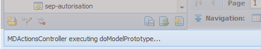
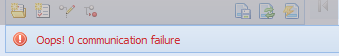

la barre de messages
====================

Figure 3 : La barre des messages.

**Disposition dans l'interface**

L'application du prototypeur communique avec l'utilisateur par l'entremise de la barre de messages. La **barre de messages** est située en bas du menu principal, c'est-à-dire le coin inférieur à gauche de l'interface. Quand l'application a besoin de communiquer à l'utilisateur la confirmation d'une opération ou de lui envoyer un message d'erreur, elle se sert de l'espace disponible dans la barre de messages pour le faire. Les messages d'erreur sont montrés en utilisant une police en couleur rouge.

Dans la figure ci-dessus, le message montre l'exécution de l'opération « doModelPrototype ».

Figure 4 : message d'erreur.

Exemple de message d'erreur: problème de communication avec le serveur.
