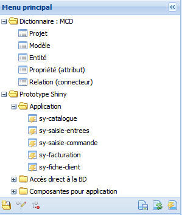

Menu principal
==============

Figure 2 : Menu des composants du dictionnaire.

Le **menu principal** affiche l'arborescence des composantes du dictionnaire (MCD) ainsi que la liste des projets et leurs vues prototypes.

Le menu principal permet d'afficher le contenu de chaque objet disponible sur l'arborescence de l'application. Ce contenu est ouvert dans la grille principale. Un nouvel onglet est ouvert pour chaque objet sélectionné.

Il est possible de cacher le menu principal en cliquant sur le bouton.

.. image:: ./images/icon_fermer24.png

Pour réafficher le menu principal cliquez sur le bouton.

**Afficher le contenu d'un objet du menu principal**
^^^^^^^^^^^^^^^^^^^^^^^^^^^^^^^^^^^^^^^^^^^^^^^^^^^^

1.Cliquez deux fois sur l'objet à ouvrir. Le nouvel onglet s'ouvrira automatiquement dans la **grille principale** ;

2.Répétez l'étape 1 pour chaque nouvel onglet à ouvrir ;

**Les fonctions du menu principal**
^^^^^^^^^^^^^^^^^^^^^^^^^^^^^^^^^^^

.. image:: ./images/newdossier.png

Créer un nouveau dossier dans l'arborescence. Pour déplacer le nouveau dossier, cliquez sur lui, sans relâcher le bouton de la souris, glissez-le et ensuite déposez-le à l'endroit voulu.

Modifier le noeud permettre de changer le nom de l'objet choisi.

.. image:: ./images/erasenode.png

Sélectionnez supprimer noeud pour supprimer un objet dans l'arborescence.

.. image:: ./images/savemenu.png

Enregistrer menu sert à enregistrer l'état actuel du menu principal. Toutes les modifications (personnalisations) réalisées dans l'arborescence seront enregistrées, en cas contraire, un menu par défaut sera toujours affiché dans l'application.

.. image:: ./images/recharmenu.png

Recharger menu fait un appel à l'application pour recharger la configuration du menu. Si les modifications effectuées ont été enregistrées, l'application retournera le dernier état enregistré du menu.

.. image:: ./images/restartmenu.png Réinitialiser menu fait un appel à l'application pour charger la configuration initiale du menu. 

