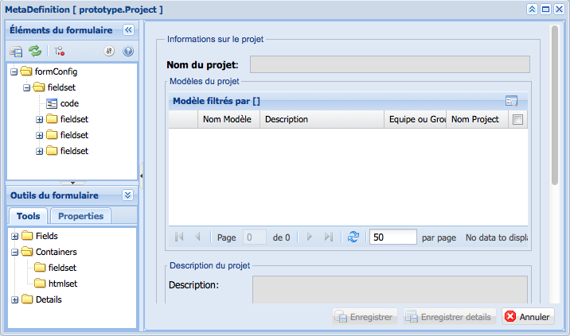
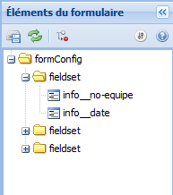

Option: Formulaire
==================

Figure 17 : Option formulaire du menu configuration.

L'option **Formulaire** ouvre une nouvelle fenêtre à partir de laquelle nous avons accès aux propriétés de personnalisation du formulaire.

Organisation de la fenêtre du formulaire
^^^^^^^^^^^^^^^^^^^^^^^^^^^^^^^^^^^^^^^^

La fenêtre du formulaire est organisée en trois grandes sections :

1. Les éléments du formulaire se situent en haut du côté gauche de la fenêtre.
2. Les outils du formulaire se situent en bas du côté gauche de la fenêtre.
3. L'aperçu du formulaire se situe du côté droit de la fenêtre.

Les éléments du formulaire
^^^^^^^^^^^^^^^^^^^^^^^^^^

Figure 18 : la fenêtre des éléments du formulaire.

La fenêtre des éléments du formulaire affiche dans une arborescence les informations (champs) que le formulaire montrera au moment de l'ouvrir pour un objet sélectionné. À partir de cette fenêtre, il est possible de personnaliser l'affichage et l'ordre d'apparition de champs sur le formulaire. L'ordre d'apparition de champs est défini selon la position de l'objet dans l'arborescence. Il est possible aussi de regrouper les champs à l'intérieur des contenants de type « Fieldset » ou « HTMLset ».

.. image:: ./images/saveform.png Enregistrer les modifications du formulaire.

.. image:: ./images/refreshform.png Rafraîchir l'aperçu du formulaire (côté droit de la fenêtre).

.. image:: ./images/erasenode.png
Supprimer un objet dans l'arborescence.
cacher fenetre 	Cacher la fenêtre des éléments du formulaire de l'interface.
icone champ 	Icône attribuée aux champs.
icone des contenants 	Icône attribuée aux contenants de type fieldset et HTML.

Les outils du formulaire
^^^^^^^^^^^^^^^^^^^^^^^^
Figure 19 : les outils du formulaire
Figure 19 : les outils du formulaire.

La fenêtre des outils du formulaire donne accès aux outils permettant de créer et de personnaliser un formulaire. Les outils sont organisés dans une arborescence où ils se retrouvent les champs, les contenants et les détails pour une vue. L'onglet des « propriétés » donne accès aux propriétés de personnalisation de l'objet sélectionné dans la fenêtre des éléments.
Fields ( Champs )

Le dossier Fields contient la liste complète des champs pour l'objet sélectionné ( un projet, un modèle, une entité, une propriété, une relation ou une vue ). Dans le cas d'une vue, les champs correspondent aux propriétés ou attributs des entités crées par l'utilisateur. On y retrouve aussi des champs crées par l'application du prototypeur comme la date de la dernière modification, le nombre de l'équipe ou groupe à qui appartient le projet, etc.
Containers ( Contenants )

Le dossier Containers est composé de deux types de contenants qui servent à regrouper plusieurs champs dans le formulaire. Un contenant de type Fieldset crée un contour autour des champs qu'il entourne. Un contenant de type HTMLset c'est un éditeur de texte HTML. Le contenant HTMLset s'utilise pour les champs de type de base « texte » que stockent des chaînes de 65, 535 caractères maximum.
Details ( Détails )

Le dossier Détails contient les détails configurés pour les projets, les modèles, les entités, les propriétés et les relations. Quand un détail est ajouté au formulaire, ce détail s'affiche dans la forme d'une grille.
L'aperçu du formulaire

L'espace réservé à l'aperçu du formulaire permet de prévisualiser les modifications appliquées au formulaire. Les modifications sont affichées en temps réel, cela veut dire que si vous changez l'ordre des champs ou que vous regroupez plusieurs champs dans un fieldset, vous verrez dans l'espace de l'aperçu le résultat final quasi instantanément.
