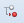

Menu des fonctions : exécuter
=============================

Fonction Exécuter pour les modèles
""""""""""""""""""""""""""""""""""

	.. image:: ./images/executermod.png
	
	*Figure 10 : fonction exécuter et son sous-menu.*
	
La fonction **Exécuter** dans le cas des modèles consiste en deux actions : doModelPrototype et doModelGraph. 
**doModelPrototype** génère les vues du prototype pour un modèle sélectionné. **doModelGraph** génère le modèle 
conceptuel graphique pour un modèle sélectionné.

Générer le prototype d'un modèle sélectionné
""""""""""""""""""""""""""""""""""""""""""""

Cette démarche tient pour acquis que le modèle de données à prototyper est déjà complété : toutes les entités ont des 
attributs et il y a des relations créés entre les entités.

1. À partir de l'onglet **Modèle**, cliquez sur la ligne de la grille principale qui corresponde au modèle à prototyper.
2. Cliquez sur le bouton **Exécuter** du menu des fonctions ou sur le petit triangle noir situé du côté droit du même bouton. Le 
   petit triangle noir affiche les deux options disponibles pour Exécuter.
3. Cliquez sur l'option **doModelPrototype**. Un message de confirmation de l'opération sera affiché sur l'interface
   (voir :doc:`la barre de message <barre_message>` pour plus de détails ).
4. Déplacez-vous sur les fonctions du menu principal. Cliquez sur le bouton |img1| Réinitialiser menu pour faire apparaître 
   dans le menu principal les vues récemment créées.

 .. note::
   Les nouvelles vues sont générées automatiquement à l'intérieur de l'arborescence AutoMenu -> ProtoOptions. Notez que 
   les vues des prototypes antérieures sont aussi affichées avec les vues récemment créées.
   Une vue est créée pour chaque entité dans le modèle de données. Vous aurez le même nombre de vues que des entités. 
   Les noms des vues sont composés du nom du modèle suivi d'un tiret (-) et du nom de l'entité qu'elle représente.
    	
5. Les vues dans l'arborescence AutoMenu -> ProtoOptions sont de vues générées automatiquement, si vous effectuez des 
   modifications sur ces vues, la prochaine fois que le menu principal sera rafraîchi, les vues retourneront à leur valeur 
   par défaut. Pour garder les modifications des vues, il est nécessaire de créer un nouveau dossier sur l'arborescence du 
   menu principal. Passez aux prochaines étapes.
6. Cliquez sur le bouton |img2| Nouveau dossier du menu principal. Entrez le nom du nouveau dossier, par exemple le nom du 
   projet. Le nouveau dossier apparaîtra à la fin de la liste des vues générées dans AutoMenu -> ProtoOptions.
7. Procédez à glisser-déposer à l'intérieur de ce dossier chacune de vues appartenant à ce projet. Sélectionnez une vue à la fois.
8. Quand toutes les vues seront à l'intérieur du dossier, glissez et déposez le dossier vers l'arborescence du menu principal. 
   Par exemple, après la composante relation. Assurez-vous que le dossier se retrouve à l'extérieur de l'arborescence AutoMenu.
9. Sélectionnez **AutoMenu** et cliquez sur le bouton |img3| Supprimer noeud du menu principal. Ceci effacera l'arborescence 
   d'AutoMenu (la suppression n'est pas définitive, pour récupérer cette arborescence cliquez sur le bouton réinitialiser du menu 
   principal).
10. Pour terminer, cliquez sur le bouton **Enregistrer menu** du menu principal.

.. warning::

    Si vous n'enregistrez pas les modifications au menu, elles seront perdues à la fermeture de l'application du prototypeur.

Fonction « Exécuter » pour les entités
""""""""""""""""""""""""""""""""""""""

	.. image:: ./images/executerent.png
	
	*Figure 11 : fonction exécuter et son sous-menu.*

La fonction **Exécuter** dans le cas des entités a une seule action : doEntityPrototype. **doEntityPrototype** génère une 
nouvelle vue à partir d'une entité sélectionnée.

Générer une vue à partir d'une entité sélectionnée
""""""""""""""""""""""""""""""""""""""""""""""""""

1. À partir de l'onglet Entité, sélectionnez sur la ligne de la grille principale qui correspond à l'entité.
2. Cliquez sur le bouton Exécuter du menu des fonctions ou sur le petit triangle noir situé du côté droit du même bouton. 
   Le petit triangle noir affiche les deux options disponibles pour Exécuter.
3. Cliquez sur l'option doEntityPrototype. Écrivez le nom de la nouvelle vue dans la fenêtre affichée à l'écran. Un message de 
   confirmation de l'opération sera montré sur l'interface ( voir `la barre de message <barre_message>` pour plus de détails ).
4. Déplacez-vous sur les fonctions du menu principal. Cliquez sur le bouton |img1| Réinitialiser menu pour faire apparaître dans 
   le menu principal la vue récemment créée.

  .. note::
	Les nouvelles vues sont générées automatiquement à l'intérieur de l'arborescence AutoMenu -> ProtoOptions. Notez que les 
	vues des prototypes antérieures sont aussi affichées avec les vues récemment créées.
	Une vue est créée pour chaque entité dans le modèle de données. Vous aurez le même nombre de vues que des entités. Les 
	noms des vues sont composés du nom du modèle suivi d'un tiret (-) et du nom de l'entité qu'elle représente.
		
5. Les vues dans l'arborescence AutoMenu -> ProtoOptions sont de vues générées automatiquement, si vous effectuez des 
   modifications sur ces vues, la prochaine fois que le menu principal sera rafraîchi, les vues retourneront à leur valeur par 
   défaut. Pour garder les modifications des vues, il est nécessaire de créer un nouveau répertoire sur l'arborescence du menu 
   principal. Si vous avez déjà créé un dossier pour le projet, glissez la nouvelle vue à l'intérieur de ce dossier. Dans le cas 
   contraire, passez aux prochaines étapes.
6. Cliquez sur le bouton |img2| Nouveau dossier du menu principal. Entrez le nom du nouveau dossier, par exemple le nom du projet. 
   Le nouveau dossier apparaîtra à la fin de la liste des vues générées.
7. Procédez à glisser-déposer à l'intérieur du dossier chacune de vues appartenant à ce projet. Sélectionnez une vue à la fois.
8. Quand toutes les vues seront à l'intérieur du dossier, glissez et déposez le dossier vers l'arborescence du menu principal. 
   Par exemple, après la composante relation. Assurez-vous que le dossier se retrouve à l'extérieur de l'arborescence AutoMenu.
9. Sélectionnez **AutoMenu** et cliquez sur le bouton |img3| Supprimer noeud du menu principal. Ceci effacera l'arborescence 
   d'AutoMenu (la suppression n'est pas définitive, pour récupérer cette arborescence cliquez sur le bouton réinitialiser du menu 
   principal).
10. Pour terminer, cliquez sur le bouton Enregistrer menu du menu principal.

.. warning::

	Si vous n'enregistrez pas les modifications au menu, elles seront perdues à la fermeture de l'application du prototypeur.

.. |img1| image:: ./images/restartmenu.png
.. |img2| image:: ./images/newdossier.png
